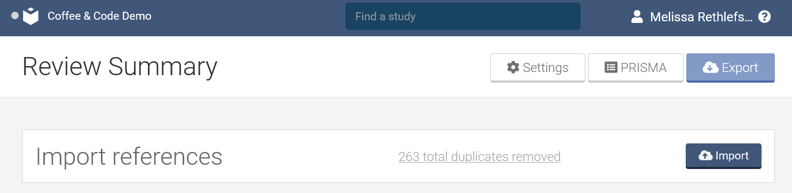

# Practice

## Uploading Data into Covidence

### PubMed Search Results

1. **Conduct a [PubMed](https://pubmed.ncbi.nlm.nih.gov/?otool=unmlib) search by copying and pasting this search into the search box:**

> ("Vascular Surgical Procedures"[Mesh] OR (Endovascular[tw] OR “Arteriovenous Shunt”[tw] OR Anastomosis[tw] OR Vascular Graft*[tw] OR Angioplast*[tw] OR “Blood Vessel Prosthesis”[tw] OR “Limb Salvage”[tw]) OR "Leg/surgery"[Mesh] OR "Amputation"[Mesh:NoExp] OR "Stents"[Mesh] OR "Embolization, Therapeutic"[Mesh] OR "Ligation"[Mesh] OR bypass[tw] OR "Saphenous Vein/transplantation"[Mesh]) AND ("Diabetic Angiopathies"[Mesh] OR "Iliac Artery"[Mesh] OR "Femoral Artery"[Mesh] OR "Popliteal Artery"[Mesh] OR "Tibial Arteries"[Mesh] OR "Vascular Patency"[Mesh] OR "Constriction, Pathologic"[Mesh] OR "Lower Extremity/blood supply"[Mesh] OR "Ischemia"[Mesh] OR "Peripheral Vascular Diseases"[Mesh] OR "Peripheral Arterial Disease"[Mesh] OR "Arteriovenous Fistula"[Mesh] OR "Arterial Occlusive Diseases"[Mesh] OR "Peripheral Arterial Occlusive Disease 1" [Supplementary Concept] OR "Intermittent Claudication"[Mesh] OR Ischaemia*[tw] OR Peripheral Angiopath*[tw] OR Diabetic Angiopath*[tw] OR Iliac Arter*[tw] OR Femoral Arter*[tw] OR femoropopliteal[tw] OR Popliteal Arter*[tw] OR Tibial Arter*[tw] OR ((vascular OR arter*) AND patency) OR pathologic Constriction*[tw] OR Lower Extremity[tw] OR Ischemia*[tw] OR Peripheral Vascular Disease*[tw] OR Peripheral Arterial Disease*[tw] OR Arteriovenous Fistula*[tw] OR Arterial Occlusive Disease*[tw] OR Claudicat*[tw]) AND ("Costs and Cost Analysis"[Mesh] OR "Fees and Charges"[Mesh] OR "Models, Economic"[Mesh] OR "economics" [Subheading] OR ("Severity of Illness Index"[Mesh] OR "Length of Stay"[Mesh] OR "Disease-Free Survival"[Mesh] OR "Quality of Life"[Mesh] OR "Quality-Adjusted Life Years"[Mesh] OR "Decision Support Techniques"[Mesh] AND (cost*[tw] OR economic*[tw])) OR cost*[ti] OR economic*[ti]) AND 2009:2022[pdat]

2. **Pick 2-3 citations by checking the boxes next to them to export for the purposes of the class.** (NOTE: Normally for a systematic review, you would download entire set.)

3. **Click on Save**

4. **Make sure Selection is Selection (n). Choose PubMed from the dropdown Format list. Click on the Create file button.**

5. **PubMed may prompt you to open the file with a citation manager program. For this class, Save the file** (Desktop is a good place).

6. **The file will be saved as a .txt file.**

### Zotero Exports

If you use a citation management tool (Zotero, EndNote, etc), you can download the results from all of your databases into that tool. Systematic review teams generally use some sort of software to manage this process, as these tools are often better about finding duplicates, etc. 

**Option 1: If you have a Zotero account AND registered in advance:**

1. **You should have access to the [Coffee & Code Group Library](https://www.zotero.org/groups/4586455/coffeeandcode/library)** (You will need to log into to access) 

2. **Pick 2-3 citations from the Coffee And Code Group Library** (CTRL click to select multiple). 

3. **Use the Export button to export the citations. **

4. **Choose RIS as the Export type.**

5. **Save the file (the desktop is a good place).**

**Option 2: If you do not have a Zotero account or did not register in advance:**

1. **Download one of these five Zotero exports to your computer** (the desktop is a good place).

[ZoteroSample1](https://github.com/unmrds/cc-systematic-review/blob/main/ZoteroSample1.ris)

[ZoteroSample2](https://github.com/unmrds/cc-systematic-review/blob/main/ZoteroSample2.ris)

[ZoteroSample3](https://github.com/unmrds/cc-systematic-review/blob/main/ZoteroSample3.ris)

[ZoteroSample4](https://github.com/unmrds/cc-systematic-review/blob/main/ZoteroSample4.ris)

[ZoteroSample5](https://github.com/unmrds/cc-systematic-review/blob/main/ZoteroSample5.ris)

### Uploading files into Covidence

1. **Log into [Covidence](https://app.covidence.org)**

2. **Navigate to the review you've been invited to (Coffee & Code Group 1, Group 2, or Group 3).**

3. **Click on Import button.**

4. **In the Import File tab, select Import in to Screen.**

5. **Browse to select the PubMed .txt file saved earlier.**

6. **Click Import. **

You will be returned to the main review screen. At the top, it may give you a message that Import is in progress. **Refresh your screen to check on progress** if the message doesn't change in 30 seconds or so. Imports are queued, so with multiple people uploading at once, it may take a minute or two.
Covidence will automatically check for and discard duplicates. You can view any discarded duplicates in the Import references bar—and fix it if they are not actual duplicates. 

7. **Follow the steps above for your Zotero file (either the one you created or one of the downloaded sample files).** 

## Settings

1. **Log into Covidence**

2. **Navigate to your assigned Review**

3. **Click on the Settings button at the top right of the Review Summary.**

All Settings can be edited, updated, and changed as you progress throughout the review. 

4. **In your small group, take turns editing the Review Settings:** (numbers correspond with the image above)

(1) For compliance with PRISMA-S and PRISMA 2020, it is imperative to document the date of last search in each database as well as all search strategies. Add today's date to the Date of Last Search field. Copy and paste the PubMed search below into the Search Strategy field.

> ("Vascular Surgical Procedures"[Mesh] OR (Endovascular[tw] OR “Arteriovenous Shunt”[tw] OR Anastomosis[tw] OR Vascular Graft*[tw] OR Angioplast*[tw] OR “Blood Vessel Prosthesis”[tw] OR “Limb Salvage”[tw]) OR "Leg/surgery"[Mesh] OR "Amputation"[Mesh:NoExp] OR "Stents"[Mesh] OR "Embolization, Therapeutic"[Mesh] OR "Ligation"[Mesh] OR bypass[tw] OR "Saphenous Vein/transplantation"[Mesh]) AND ("Diabetic Angiopathies"[Mesh] OR "Iliac Artery"[Mesh] OR "Femoral Artery"[Mesh] OR "Popliteal Artery"[Mesh] OR "Tibial Arteries"[Mesh] OR "Vascular Patency"[Mesh] OR "Constriction, Pathologic"[Mesh] OR "Lower Extremity/blood supply"[Mesh] OR "Ischemia"[Mesh] OR "Peripheral Vascular Diseases"[Mesh] OR "Peripheral Arterial Disease"[Mesh] OR "Arteriovenous Fistula"[Mesh] OR "Arterial Occlusive Diseases"[Mesh] OR "Peripheral Arterial Occlusive Disease 1" [Supplementary Concept] OR "Intermittent Claudication"[Mesh] OR Ischaemia*[tw] OR Peripheral Angiopath*[tw] OR Diabetic Angiopath*[tw] OR Iliac Arter*[tw] OR Femoral Arter*[tw] OR femoropopliteal[tw] OR Popliteal Arter*[tw] OR Tibial Arter*[tw] OR ((vascular OR arter*) AND patency) OR pathologic Constriction*[tw] OR Lower Extremity[tw] OR Ischemia*[tw] OR Peripheral Vascular Disease*[tw] OR Peripheral Arterial Disease*[tw] OR Arteriovenous Fistula*[tw] OR Arterial Occlusive Disease*[tw] OR Claudicat*[tw]) AND ("Costs and Cost Analysis"[Mesh] OR "Fees and Charges"[Mesh] OR "Models, Economic"[Mesh] OR "economics" [Subheading] OR ("Severity of Illness Index"[Mesh] OR "Length of Stay"[Mesh] OR "Disease-Free Survival"[Mesh] OR "Quality of Life"[Mesh] OR "Quality-Adjusted Life Years"[Mesh] OR "Decision Support Techniques"[Mesh] AND (cost*[tw] OR economic*[tw])) OR cost*[ti] OR economic*[ti]) AND 2009:2022[pdat]

(2) We are pretending to update the Moriarty et al systematic review. Copy and paste the citation for that paper into the Your review citation field.

> Moriarty JP, Murad MH, Shah ND, Prasad C, Montori VM, Erwin PJ, Forbes TL, Meissner MH, Stoner MC; Society for Vascular Surgery Committee on Comparative Effectiveness. A systematic review of lower extremity arterial revascularization economic analyses. J Vasc Surg. 2011 Oct;54(4):1131-1144.e1. doi: 10.1016/j.jvs.2011.04.058. PMID: 21971093.

(3) The number of screeners and data extractors can be adjusted. Best practice is to leave each of them at 2. You can experiment with your group to see how things change when you change *Reviewers required for screen* to 1 and then change it back to 2.

(4) Covidence comes with 2 options for data extraction. Always keep it as Extraction 2.0 if you want any flexibility with your review.

Be sure to click the **Save** button when you make a change.

5. **Go to the Reviewers tab.** You can see the reviewers who are participating. 

6. **On the Reviewers tab, you may send an invitation to a colleague.**

7. **Navigate to the Team settings tab.**

The Team settings screen lets you see the overall progress on screening and data extraction by each team member. You can also change the "rules" for each step of the screening and data extraction process.

In the image below, the Title and abstract screening settings are displayed. Rules are set to ensure that one of two team members must review each abstract. Only one reviewer has permission to resolve conflicts.

 

8. **Experiment with changing settings in the Title and abstract screening and Full text screening options** (scroll down the page to see the Full text screening options).

9. **Navigate to the Criteria & exclusion reasons tab.** Content was pre-added for the inclusion/exclusion criteria and the highlights. When we are practicing screening, you may wish to come back to this page and make edits.

10. **Navigate to the Study tags tab.** 

There are two default "study tags" which cannot be deleted. Teams can add tags as needed.

11. **Click on the back arrow at the top of the screen to return to the Review Summary screen.**

## Screening

### Title and abstract screening

1. On the Review Summary screen, there are two options for screening: Title and abstract and Full text. In the Title and abstract screening box, click on Continue. 

2. To best fit your screening style, multiple options are provided.

(A) You can show the inclusion and exclusion criteria at the top of the screening by clicking the Show criteria button.

(B) You can highlight words using the Add highlights button. Trying editing the highlights in the Settings > Criteria and exclusion reasons tab to see how this can be customized.

(C) If you only want to screen based on titles, you can Hide abstracts--or change it back.

(D) This is the actual screening part! Click on Yes to include an article, No to exclude it, and Maybe if you are hedging your bets. Once you click on an option, the title/abstract will be removed from your list.

(E) If you want more customization on which abstracts you see--or don't--this button can change the display for individual items. 

3. Screen at least 10 abstracts (the more the better for this exercise!). You can try to use the criteria to decide, or just click some buttons to see what happens.

4. Once everyone in your group has screened at least 10 abstracts, click on the back arrow. 

5. Your progress is tracked. If your group had any conflicts, you will be prompted to resolve them. If your group had two people vote to include a title/abstract, it will be in the Full text review box.

### Full text review

Even if your group didn't agree, there are multiple articles available to screen. The first step is to associate the full text with each record.

*HINT: If you have a lot of full text items to review, you are likely going to want to bulk import PDF files. For instructions on how to do this (not part of this class), see the Covidence help page [Bulk PDF Import (beta)](https://support.covidence.org/help/bulk-pdf-import-9cd5e1b4)*

**To add PDFs by hand:**

1. From the Full text review box, click on the X studies to screen link (where X is the number of items in your queue).

2. The PDF files you will need are linked below. In your small group, **decide who will upload each full text file**. Once you have decided, click on each link for your chosen items and save the PDF on your desktop. Renaming them with the first author's last name is a good way to easily find them again.

Forbes: [https://libkey.io/libraries/2623/articles/54873105/full-text-file?utm_source=nomad](https://libkey.io/libraries/2623/articles/54873105/full-text-file?utm_source=nomad)

Bradbury: [https://njl-admin.nihr.ac.uk/document/download/2001921](https://njl-admin.nihr.ac.uk/document/download/2001921)

Hogendoorn: [https://libkey.io/libraries/2623/articles/57825000/full-text-file?utm_source=nomad](https://libkey.io/libraries/2623/articles/57825000/full-text-file?utm_source=nomad)

Tang: [https://libkey.io/libraries/2623/articles/205568596/full-text-file?utm_source=nomad](https://libkey.io/libraries/2623/articles/205568596/full-text-file?utm_source=nomad)

Vossen: [https://libkey.io/libraries/2623/articles/290046150/full-text-file?utm_source=nomad](https://libkey.io/libraries/2623/articles/290046150/full-text-file?utm_source=nomad)

Peters: [https://libkey.io/libraries/2623/articles/291030503/full-text-file?utm_source=nomad](https://libkey.io/libraries/2623/articles/291030503/full-text-file?utm_source=nomad)

Smith: [https://libkey.io/libraries/2623/articles/476485909/full-text-file?utm_source=nomad](https://libkey.io/libraries/2623/articles/476485909/full-text-file?utm_source=nomad)

3. You have two options, adding the full text directly to Covidence (best if you have a PDF) or Adding a reference URL (best for non-PDF materials). 

In your small group, **decide who will upload each full text file** (see above).

4. Navigate to the Covidence record that matches your assigned article. 

5. Click on Add full text.

6. Browse to the correct file. Click on the Finished button. 

7. To view the full text, click on View full text and then click on the link below UPLOADED FILES. 

8. Once you have uploaded at least one full text article, practice screening. There are only two options in full text screening: Include and Exclude. 

All included articles will move into the Extraction queue.

## Data Extraction

Data extraction is highly dependent on the review. The default data extraction form is available, but you can also edit it to customize it. 

You can now create a draft extraction form prior to having any studies to extract. 

1. In the Extraction box, click on X studies to extract. On the top of the page are two options: Data Extraction Template and Quality Assessment Template. Click on Data Extraction Template to edit the template.

2. You can edit the template or start from scratch. Try experimenting!

3. Save as a draft to save a copy in progress--or Publish to start extracting data.

4. The Quality Assessment Template is the Cochrane Risk of Bias tool. If you want to use another tool, you can customize this template. 
