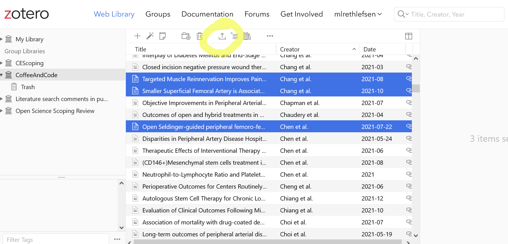

# Practice

## Uploading Data into Covidence

### PubMed Search Results

1. **Conduct a [PubMed](https://pubmed.ncbi.nlm.nih.gov/?otool=unmlib) search by copying and pasting this search into the search box:**

> ("Vascular Surgical Procedures"[Mesh] OR (Endovascular[tw] OR “Arteriovenous Shunt”[tw] OR Anastomosis[tw] OR Vascular Graft*[tw] OR Angioplast*[tw] OR “Blood Vessel Prosthesis”[tw] OR “Limb Salvage”[tw]) OR "Leg/surgery"[Mesh] OR "Amputation"[Mesh:NoExp] OR "Stents"[Mesh] OR "Embolization, Therapeutic"[Mesh] OR "Ligation"[Mesh] OR bypass[tw] OR "Saphenous Vein/transplantation"[Mesh]) AND ("Diabetic Angiopathies"[Mesh] OR "Iliac Artery"[Mesh] OR "Femoral Artery"[Mesh] OR "Popliteal Artery"[Mesh] OR "Tibial Arteries"[Mesh] OR "Vascular Patency"[Mesh] OR "Constriction, Pathologic"[Mesh] OR "Lower Extremity/blood supply"[Mesh] OR "Ischemia"[Mesh] OR "Peripheral Vascular Diseases"[Mesh] OR "Peripheral Arterial Disease"[Mesh] OR "Arteriovenous Fistula"[Mesh] OR "Arterial Occlusive Diseases"[Mesh] OR "Peripheral Arterial Occlusive Disease 1" [Supplementary Concept] OR "Intermittent Claudication"[Mesh] OR Ischaemia*[tw] OR Peripheral Angiopath*[tw] OR Diabetic Angiopath*[tw] OR Iliac Arter*[tw] OR Femoral Arter*[tw] OR femoropopliteal[tw] OR Popliteal Arter*[tw] OR Tibial Arter*[tw] OR ((vascular OR arter*) AND patency) OR pathologic Constriction*[tw] OR Lower Extremity[tw] OR Ischemia*[tw] OR Peripheral Vascular Disease*[tw] OR Peripheral Arterial Disease*[tw] OR Arteriovenous Fistula*[tw] OR Arterial Occlusive Disease*[tw] OR Claudicat*[tw]) AND ("Costs and Cost Analysis"[Mesh] OR "Fees and Charges"[Mesh] OR "Models, Economic"[Mesh] OR "economics" [Subheading] OR ("Severity of Illness Index"[Mesh] OR "Length of Stay"[Mesh] OR "Disease-Free Survival"[Mesh] OR "Quality of Life"[Mesh] OR "Quality-Adjusted Life Years"[Mesh] OR "Decision Support Techniques"[Mesh] AND (cost*[tw] OR economic*[tw])) OR cost*[ti] OR economic*[ti]) AND 2009:2022[pdat]

2. **Pick 2-3 citations by checking the boxes next to them to export for the purposes of the class.** (NOTE: Normally for a systematic review, you would download entire set.)

3. **Click on Save**

4. **Make sure Selection is Selection (n). Choose PubMed from the dropdown Format list. Click on the Create file button.**

5. **PubMed may prompt you to open the file with a citation manager program. For this class, Save the file** (Desktop is a good place).

6. **The file will be saved as a .txt file.**

### Zotero Exports

If you use a citation management tool (Zotero, EndNote, etc), you can download the results from all of your databases into that tool. Systematic review teams generally use some sort of software to manage this process, as these tools are often better about finding duplicates, etc. 

**Option 1: If you have a Zotero account AND registered in advance:**

1. **You should have access to the [Coffee & Code Group Library](https://www.zotero.org/groups/4586455/coffeeandcode/library)** (You will need to log into to access) 

2. **Pick 2-3 citations from the Coffee And Code Group Library** (CTRL click to select multiple). 

3. **Use the Export button to export the citations. **

4. **Choose RIS as the Export type.**

5. **Save the file (the desktop is a good place).**

**Option 2: If you do not have a Zotero account or did not register in advance:**

1. **Download one of these five Zotero exports to your computer** (the desktop is a good place).

[ZoteroSample1](https://github.com/unmrds/cc-systematic-review/blob/main/ZoteroSample1.ris)

[ZoteroSample2](https://github.com/unmrds/cc-systematic-review/blob/main/ZoteroSample2.ris)

[ZoteroSample3](https://github.com/unmrds/cc-systematic-review/blob/main/ZoteroSample3.ris)

[ZoteroSample4](https://github.com/unmrds/cc-systematic-review/blob/main/ZoteroSample4.ris)

[ZoteroSample5](https://github.com/unmrds/cc-systematic-review/blob/main/ZoteroSample5.ris)

### Uploading files into Covidence

1. **Log into [Covidence](https://app.covidence.org)**

2. **Navigate to the review you've been invited to (Coffee & Code Group 1, Group 2, or Group 3).**

3. **Click on Import button.**

4. **In the Import File tab, select Import in to Screen.**

5. **Browse to select the PubMed .txt file saved earlier.**

6. **Click Import. **

You will be returned to the main review screen. At the top, it may give you a message that Import is in progress. **Refresh your screen to check on progress** if the message doesn't change in 30 seconds or so. Imports are queued, so with multiple people uploading at once, it may take a minute or two.
Covidence will automatically check for and discard duplicates. You can view any discarded duplicates in the Import references bar—and fix it if they are not actual duplicates. 

7. **Follow the steps above for your Zotero file (either the one you created or one of the downloaded sample files).** 

