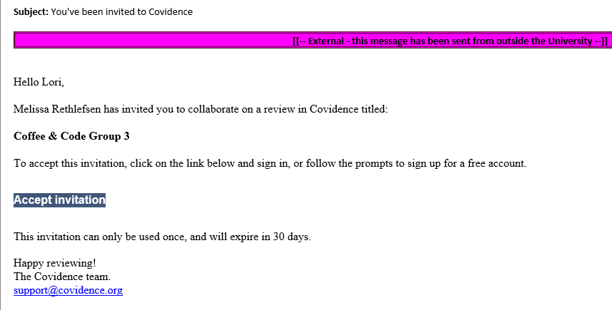
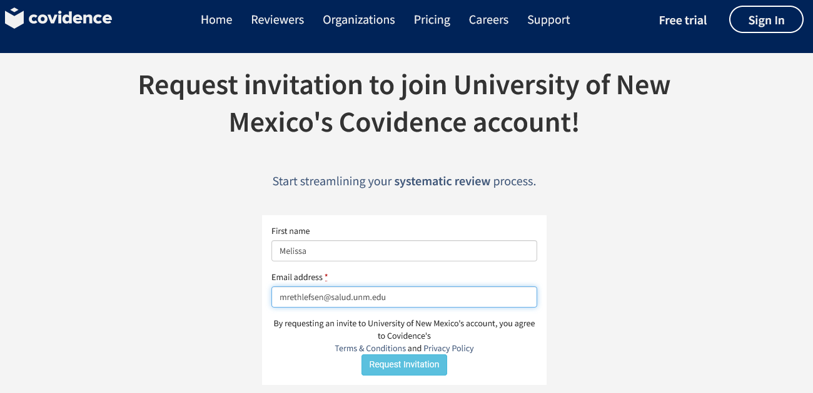

# Systematic Reviews: Coffee & Code

## Prework

1. Read the methods section of the [article](https://libkey.io/libraries/2623/articles/54369214/full-text-file?utm_source=nomad); review or skim the rest of the article

> Citation for Prework article: Moriarty JP, Murad MH, Shah ND, Prasad C, Montori VM, Erwin PJ, Forbes TL, Meissner MH, Stoner MC; Society for Vascular Surgery Committee on Comparative Effectiveness. A systematic review of lower extremity arterial revascularization economic analyses. J Vasc Surg. 2011 Oct;54(4):1131-1144.e1. doi: 10.1016/j.jvs.2011.04.058. PMID: 21971093.

2. Accept the invitation to participate in a Coffee & Code review on [Covidence](https://app.covidence.org) (required to participate)

If you are UNM affiliated, you may also [create your own account](https://app.covidence.org/organizations/QlZl7/signup) allowing you to create unlimited reviews.

3. Sign up for [Zotero](https://www.zotero.org/) (not required, but may be helpful)

> If you have a Zotero account (created for the class or an old one), please send the email associated with your account to mrethlefsen [at] salud.unm.edu

### Files

[ZoteroSample1](https://github.com/unmrds/cc-systematic-review/blob/main/ZoteroSample1.ris)
[ZoteroSample2](https://github.com/unmrds/cc-systematic-review/blob/main/ZoteroSample2.ris)
[ZoteroSample3](https://github.com/unmrds/cc-systematic-review/blob/main/ZoteroSample3.ris)
[ZoteroSample4](https://github.com/unmrds/cc-systematic-review/blob/main/ZoteroSample4.ris)
[ZoteroSample5](https://github.com/unmrds/cc-systematic-review/blob/main/ZoteroSample5.ris)

### Links

**Prereading:** 

[https://libkey.io/libraries/2623/articles/54369214/full-text-file?utm_source=nomad](https://libkey.io/libraries/2623/articles/54369214/full-text-file?utm_source=nomad)

**Full text links for Full Text Review:**

Forbes: [https://libkey.io/libraries/2623/articles/54873105/full-text-file?utm_source=nomad](https://libkey.io/libraries/2623/articles/54873105/full-text-file?utm_source=nomad)

Bradbury: [https://njl-admin.nihr.ac.uk/document/download/2001921](https://njl-admin.nihr.ac.uk/document/download/2001921)

Hogendoorn: [https://libkey.io/libraries/2623/articles/57825000/full-text-file?utm_source=nomad](https://libkey.io/libraries/2623/articles/57825000/full-text-file?utm_source=nomad)

Tang: [https://libkey.io/libraries/2623/articles/205568596/full-text-file?utm_source=nomad](https://libkey.io/libraries/2623/articles/205568596/full-text-file?utm_source=nomad)

Vossen: [https://libkey.io/libraries/2623/articles/290046150/full-text-file?utm_source=nomad](https://libkey.io/libraries/2623/articles/290046150/full-text-file?utm_source=nomad)

Peters: [https://libkey.io/libraries/2623/articles/291030503/full-text-file?utm_source=nomad](https://libkey.io/libraries/2623/articles/291030503/full-text-file?utm_source=nomad)

Smith: [https://libkey.io/libraries/2623/articles/476485909/full-text-file?utm_source=nomad](https://libkey.io/libraries/2623/articles/476485909/full-text-file?utm_source=nomad)
